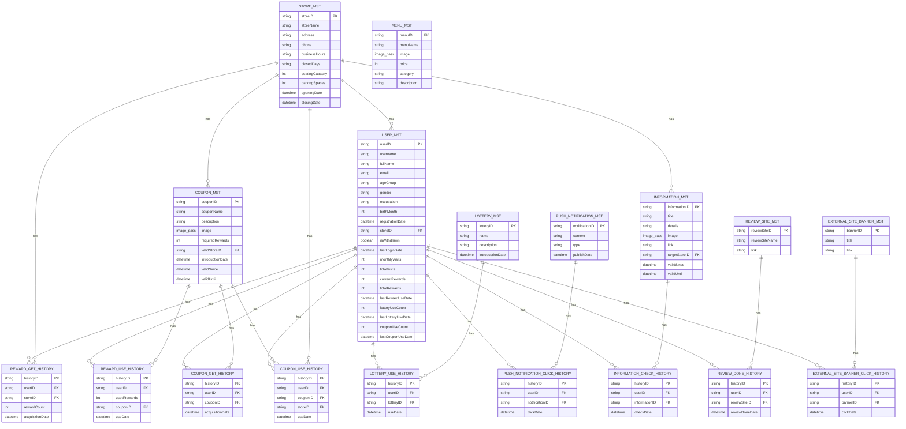

```mermaid
erDiagram
    STORE_MST ||--o{ USER_MST : has
    USER_MST ||--o{ REWARD_GET_HISTORY : has
    STORE_MST ||--o{ REWARD_GET_HISTORY : has
    USER_MST ||--o{ REWARD_USE_HISTORY : has
    COUPON_MST ||--o{ REWARD_USE_HISTORY : has
    STORE_MST ||--o{ COUPON_MST : has
    USER_MST ||--o{ COUPON_GET_HISTORY : has
    COUPON_MST ||--o{ COUPON_GET_HISTORY : has
    USER_MST ||--o{ COUPON_USE_HISTORY : has
    COUPON_MST ||--o{ COUPON_USE_HISTORY : has
    STORE_MST ||--o{ COUPON_USE_HISTORY : has
    USER_MST ||--o{ LOTTERY_USE_HISTORY : has
    LOTTERY_MST ||--o{ LOTTERY_USE_HISTORY : has
    USER_MST ||--o{ PUSH_NOTIFICATION_CLICK_HISTORY : has
    PUSH_NOTIFICATION_MST ||--o{ PUSH_NOTIFICATION_CLICK_HISTORY : has
    STORE_MST ||--o{ INFORMATION_MST : has
    USER_MST ||--o{ INFORMATION_CHECK_HISTORY : has
    INFORMATION_MST ||--o{ INFORMATION_CHECK_HISTORY : has
    USER_MST ||--o{ REVIEW_DONE_HISTORY : has
    REVIEW_SITE_MST ||--o{ REVIEW_DONE_HISTORY : has
    USER_MST ||--o{ EXTERNAL_SITE_BANNER_CLICK_HISTORY : has
    EXTERNAL_SITE_BANNER_MST ||--o{ EXTERNAL_SITE_BANNER_CLICK_HISTORY : has

    USER_MST {
        string userID PK
        string username
        string fullName
        string email
        string ageGroup
        string gender
        string occupation
        int birthMonth
        datetime registrationDate
        string storeID FK
        boolean isWithdrawn
        datetime lastLoginDate
        int monthlyVisits
        int totalVisits
        int currentRewards
        int totalRewards
        datetime lastRewardUseDate
        int lotteryUseCount
        datetime lastLotteryUseDate
        int couponUseCount
        datetime lastCouponUseDate
    }
    STORE_MST {
        string storeID PK
        string storeName
        string address
        string phone
        string businessHours
        string closedDays
        int seatingCapacity
        int parkingSpaces
        datetime openingDate
        datetime closingDate
    }
    REWARD_GET_HISTORY {
        string historyID PK
        string userID FK
        string storeID FK
        int rewardCount
        datetime acquisitionDate
    }
    REWARD_USE_HISTORY {
        string historyID PK
        string userID FK
        int usedRewards
        string couponID FK
        datetime useDate
    }
    COUPON_MST {
        string couponID PK
        string couponName
        string description
        image_pass image
        int requiredRewards
        string validStoreID FK
        datetime introductionDate
        datetime validSince
        datetime validUntil
    }
    COUPON_GET_HISTORY {
        string historyID PK
        string userID FK
        string couponID FK
        datetime acquisitionDate
    }
    COUPON_USE_HISTORY {
        string historyID PK
        string userID FK
        string couponID FK
        string storeID FK
        datetime useDate
    }
    LOTTERY_MST {
        string lotteryID PK
        string name
        string description
        datetime introductionDate
    }
    LOTTERY_USE_HISTORY {
        string historyID PK
        string userID FK
        string lotteryID FK
        datetime useDate
    }
    PUSH_NOTIFICATION_MST {
        string notificationID PK
        string content
        string type
        datetime publishDate
    }
    PUSH_NOTIFICATION_CLICK_HISTORY {
        string historyID PK
        string userID FK
        string notificationID FK
        datetime clickDate
    }
    INFORMATION_MST {
        string informationID PK
        string title
        string details
        image_pass image
        string link
        string targetStoreID FK
        datetime validSince
        datetime validUntil
    }
    INFORMATION_CHECK_HISTORY {
        string historyID PK
        string userID FK
        string informationID FK
        datetime checkDate
    }
    REVIEW_SITE_MST {
        string reviewSiteID PK
        string reviewSiteName
        string link
    }
    REVIEW_DONE_HISTORY {
        string historyID PK
        string userID FK
        string reviewSiteID FK
        datetime reviewDoneDate
    }
    EXTERNAL_SITE_BANNER_MST {
        string bannerID PK
        string title
        string link
    }
    EXTERNAL_SITE_BANNER_CLICK_HISTORY {
        string historyID PK
        string userID FK
        string bannerID FK
        datetime clickDate
    }
    MENU_MST {
        string menuID PK
        string menuName
        image_pass image
        int price
        string category
        string description
    }
```