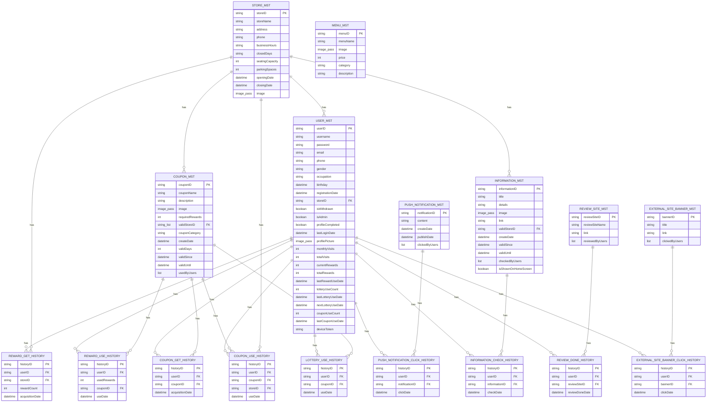

```mermaid
erDiagram
    STORE_MST ||--o{ USER_MST : has
    USER_MST ||--o{ REWARD_GET_HISTORY : has
    STORE_MST ||--o{ REWARD_GET_HISTORY : has
    USER_MST ||--o{ REWARD_USE_HISTORY : has
    COUPON_MST ||--o{ REWARD_USE_HISTORY : has
    STORE_MST ||--o{ COUPON_MST : has
    USER_MST ||--o{ COUPON_GET_HISTORY : has
    COUPON_MST ||--o{ COUPON_GET_HISTORY : has
    USER_MST ||--o{ COUPON_USE_HISTORY : has
    COUPON_MST ||--o{ COUPON_USE_HISTORY : has
    STORE_MST ||--o{ COUPON_USE_HISTORY : has
    USER_MST ||--o{ LOTTERY_USE_HISTORY : has
    COUPON_MST ||--o{ LOTTERY_USE_HISTORY : has
    USER_MST ||--o{ PUSH_NOTIFICATION_CLICK_HISTORY : has
    PUSH_NOTIFICATION_MST ||--o{ PUSH_NOTIFICATION_CLICK_HISTORY : has
    STORE_MST ||--o{ INFORMATION_MST : has
    USER_MST ||--o{ INFORMATION_CHECK_HISTORY : has
    INFORMATION_MST ||--o{ INFORMATION_CHECK_HISTORY : has
    USER_MST ||--o{ REVIEW_DONE_HISTORY : has
    REVIEW_SITE_MST ||--o{ REVIEW_DONE_HISTORY : has
    USER_MST ||--o{ EXTERNAL_SITE_BANNER_CLICK_HISTORY : has
    EXTERNAL_SITE_BANNER_MST ||--o{ EXTERNAL_SITE_BANNER_CLICK_HISTORY : has

    USER_MST {
        string userID PK
        string username
        string password
        string email
        string phone
        string gender
        string occupation
        datetime birthday
        datetime registrationDate
        string storeID FK
        boolean isWithdrawn
        boolean isAdmin
        boolean profileCompleted
        datetime lastLoginDate
        image_pass profilePicture
        int monthlyVisits
        int totalVisits
        int currentRewards
        int totalRewards
        datetime lastRewardUseDate
        int lotteryUseCount
        datetime lastLotteryUseDate
        datetime nextLotteryUseDate
        int couponUseCount
        datetime lastCouponUseDate
        string deviceToken
    }
    STORE_MST {
        string storeID PK
        string storeName
        string address
        string phone
        string businessHours
        string closedDays
        int seatingCapacity
        int parkingSpaces
        datetime openingDate
        datetime closingDate
        image_pass image 
    }
    REWARD_GET_HISTORY {
        string historyID PK
        string userID FK
        string storeID FK
        int rewardCount
        datetime acquisitionDate
    }
    REWARD_USE_HISTORY {
        string historyID PK
        string userID FK
        int usedRewards
        string couponID FK
        datetime useDate
    }
    COUPON_MST {
        string couponID PK
        string couponName
        string description
        image_pass image
        int requiredRewards
        string_list validStoreID FK
        string couponCategory 
        datetime createDate
        int validDays
        datetime validSince
        datetime validUntil
        list usedByUsers
    }
    COUPON_GET_HISTORY {
        string historyID PK
        string userID FK
        string couponID FK
        datetime acquisitionDate
    }
    COUPON_USE_HISTORY {
        string historyID PK
        string userID FK
        string couponID FK
        string storeID FK
        datetime useDate
    }
    LOTTERY_USE_HISTORY {
        string historyID PK
        string userID FK
        string couponID FK
        datetime useDate
    }
    PUSH_NOTIFICATION_MST {
        string notificationID PK
        string content
        datetime createDate
        datetime publishDate
        list clickedByUsers
    }
    PUSH_NOTIFICATION_CLICK_HISTORY {
        string historyID PK
        string userID FK
        string notificationID FK
        datetime clickDate
    }
    INFORMATION_MST {
        string informationID PK
        string title
        string details
        image_pass image
        string link
        string validStoreID FK
        datetime createDate
        datetime validSince
        datetime validUntil
        list checkedByUsers
        boolean isShownOnHomeScreen
    }
    INFORMATION_CHECK_HISTORY {
        string historyID PK
        string userID FK
        string informationID FK
        datetime checkDate
    }
    REVIEW_SITE_MST {
        string reviewSiteID PK
        string reviewSiteName
        string link
        list reviewedByUsers
    }
    REVIEW_DONE_HISTORY {
        string historyID PK
        string userID FK
        string reviewSiteID FK
        datetime reviewDoneDate
    }
    EXTERNAL_SITE_BANNER_MST {
        string bannerID PK
        string title
        string link
        list clickedByUsers
    }
    EXTERNAL_SITE_BANNER_CLICK_HISTORY {
        string historyID PK
        string userID FK
        string bannerID FK
        datetime clickDate
    }
    MENU_MST {
        string menuID PK
        string menuName
        image_pass image
        int price
        string category
        string description
    }
```